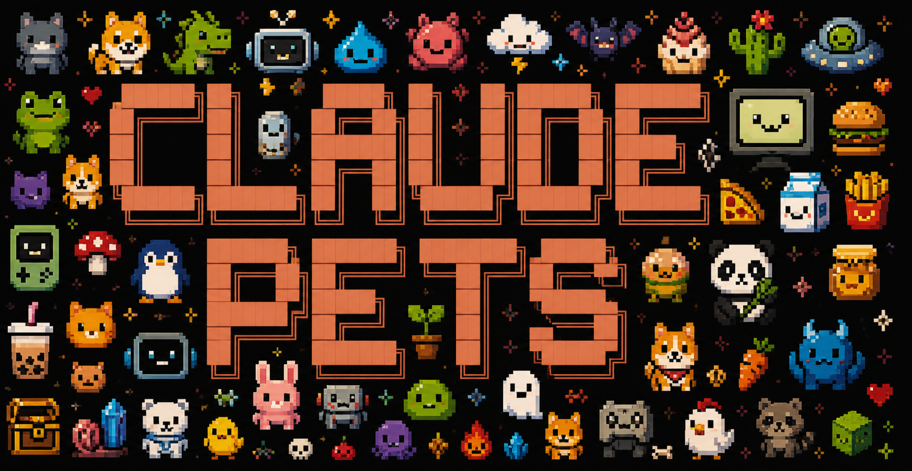

<p align="center">
  
</p>

<h1 align="center">Claude Pets</h1>

<p align="center">
  <strong>Make Claude Code feel alive with OpenPets.</strong>
</p>

<p align="center">
  Tiny Claude Code hooks that update your desktop pet while Claude works.
</p>

---
## Video


https://github.com/user-attachments/assets/a10edb8a-d13a-4b99-96bc-ea5c7cade741


## What is Claude Pets?

Claude Pets connects Claude Code activity to [OpenPets](https://github.com/alvinunreal/openpets), a local desktop pet.

## Requirements

- [Bun](https://bun.com) `>= 1.3.0`
- Claude Code
- OpenPets desktop app

## Quick start

### 1. Install OpenPets desktop

Download the latest OpenPets app:

https://github.com/alvinunreal/openpets/releases/latest

Pick the file for your OS:

- **macOS Apple Silicon**: `OpenPets-*-arm64.dmg` or `OpenPets-*-arm64.zip`
- **Windows**: `OpenPets-Setup-*-x64.exe`
- **Linux**: `OpenPets-*-x86_64.AppImage` or `OpenPets-*-amd64.deb`

Open the app once. You should see the pet on your desktop and an OpenPets tray/menu-bar icon.

> Preview builds are unsigned, so macOS or Windows may show a warning on first launch.

If macOS says the app is damaged or should be moved to Trash, remove the quarantine flag and open it again:

```bash
xattr -dr com.apple.quarantine /Applications/OpenPets.app
open /Applications/OpenPets.app
```

### 2. Add OpenPets to Claude Code

This gives Claude Code tools for talking to and controlling the pet:

```bash
claude mcp add -s user openpets -- bunx @open-pets/mcp
```

Restart Claude Code, then check:

```bash
claude mcp list
```

You should see `openpets`.

### 3. Enable automatic Claude reactions

Install Claude Pets hooks globally:

```bash
bunx @open-pets/claude-pets install
```

This updates your user-wide Claude Code settings:

```txt
~/.claude/settings.json
```

The installer preserves unrelated settings and creates a backup before writing.

Restart Claude Code after installing, then run `/hooks` in Claude Code. The Claude Pets commands should appear under user settings. If they do not appear there, Claude Code has not loaded the hooks yet.

## Test it

With OpenPets running:

```bash
bunx @open-pets/claude-pets test-event thinking
```

Your pet should animate briefly, then return to idle.

You can also try:

```bash
bunx @open-pets/claude-pets test-event testing
bunx @open-pets/claude-pets test-event success
```

## Uninstall

Remove the global hooks:

```bash
bunx @open-pets/claude-pets uninstall
```

This only removes Claude Pets managed hook commands from `~/.claude/settings.json`.

## Troubleshooting

### OpenPets is not reacting

1. Start the OpenPets desktop app.
2. Run:

```bash
bunx @open-pets/claude-pets test-event thinking
```

3. If nothing happens, restart OpenPets and try again.

### Hooks are not firing

1. Make sure you installed hooks:

```bash
bunx @open-pets/claude-pets install
```

2. Restart Claude Code.
3. In Claude Code, run `/hooks` and confirm the Claude Pets command appears under user settings. Treat `/hooks` as the source of truth: if Claude Pets is not listed there, Claude Code has not loaded the hooks.
4. Check that `~/.claude/settings.json` contains `@open-pets/claude-pets`.
5. If `bunx @open-pets/claude-pets test-event thinking` works but normal Claude Code prompts do not update the pet, the desktop app is working and the issue is hook loading.

On Windows, you can also test the hook command directly from PowerShell while OpenPets is running:

```powershell
'{"hook_event_name":"UserPromptSubmit"}' | bunx --bun @open-pets/claude-pets@0.1.0 hook
```

If this makes the pet think, the hook command works and Claude Code still needs to load the hook config.

### Bun is missing

Install Bun first:

https://bun.com

### Restore settings from backup

Every write creates a backup next to the settings file:

```txt
~/.claude/settings.json.bak-<timestamp>
```

Quit Claude Code, copy the backup over `~/.claude/settings.json`, then restart Claude Code.

## Advanced

### Project-only install

Global install is recommended. Project-only hooks are written to `.claude/settings.local.json`, but Claude Code must load that project settings file for the hooks to run. Always verify project-only installs with `/hooks`.

If you only want Claude Pets hooks in one project, run this from that project root:

```bash
bunx @open-pets/claude-pets install --project
```

This writes project-local settings instead:

```txt
.claude/settings.local.json
```

Uninstall project-local hooks with:

```bash
bunx @open-pets/claude-pets uninstall --project
```

### Preview settings without writing

```bash
bunx @open-pets/claude-pets install --dry-run
```

### Print the hook settings snippet

```bash
bunx @open-pets/claude-pets print
```

Production hooks use this command:

```txt
bunx --bun @open-pets/claude-pets@0.1.0 hook
```

## Commands

```txt
claude-pets install [--dry-run] [--project] [--local-command]
claude-pets uninstall [--dry-run] [--project]
claude-pets print [--local-command]
claude-pets hook
claude-pets test-event <state>
```

## Local development

```bash
git clone https://github.com/alvinunreal/claude-pets.git
cd claude-pets
bun install
bun test
bun run typecheck
bun run build
```

Install hooks pointing at your local checkout:

```bash
bun src/cli.ts install --local-command
```

## Recommended setup

Use both OpenPets integrations for the best experience:

1. **OpenPets MCP** - lets Claude intentionally speak/control the pet.
2. **Claude Pets hooks** - automatic background state changes while Claude works.
